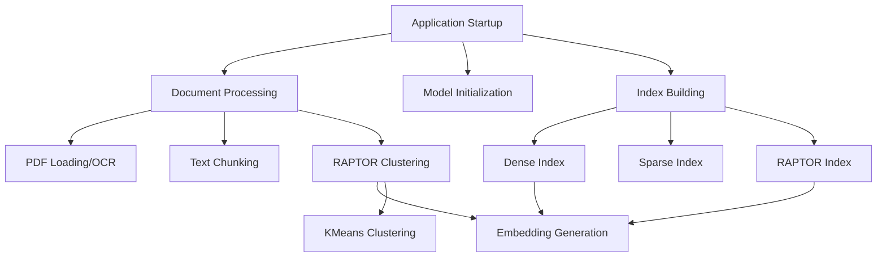

# RAG Pipeline Performance Analysis

## Issue Summary
The RAG pipeline application takes approximately 2 minutes to start up, which significantly impacts user experience. This analysis identifies the root causes and proposes optimization strategies.

## Root Causes of Slow Startup

### 1. Document Processing Pipeline
The application processes 3 PDF documents during startup:
- Uses `UnstructuredFileLoader` which can be slow for large PDFs
- Performs OCR processing for PDFs without text layers
- Processes all documents every time the application starts

### 2. Text Chunking and RAPTOR Clustering
- Splits all documents into chunks using `RecursiveCharacterTextSplitter`
- Generates embeddings for all chunks using the embedding model
- Performs KMeans clustering to create hierarchical document structure

### 3. Index Building
- Creates multiple indexes (dense, sparse, RAPTOR) during startup
- Each index requires generating embeddings which is computationally expensive
- Uses Chroma vector store which may not be the fastest option

### 4. Model Loading
- Initializes multiple Ollama models (generator, translator, embedding)
- Connects to Ollama service during startup

## Detailed Performance Breakdown

## Optimization Strategies

### 1. Caching and Serialization
**Implementation**: Save processed documents, chunks, and indexes to disk after first processing
- **Benefit**: Eliminates reprocessing on subsequent startups
- **Implementation**: Use pickle or joblib for fast serialization
- **Impact**: Could reduce startup time by 60-80%

### 2. Lazy Loading
**Implementation**: Defer document processing and index building until first query
- **Benefit**: Immediate API availability
- **Implementation**: Background processing with health check indicators
- **Impact**: Perceived startup time reduced to seconds

### 3. Parallel Processing
**Implementation**: Use multiprocessing for document processing and embedding generation
- **Benefit**: Better CPU utilization
- **Implementation**: Concurrent processing of documents and chunks
- **Impact**: 20-50% reduction in processing time on multi-core systems

### 4. Selective Processing
**Implementation**: Only process changed/new documents since last run
- **Benefit**: Avoid reprocessing unchanged documents
- **Implementation**: File modification time checking
- **Impact**: Significant improvement for incremental updates

### 5. Model Optimization
**Implementation**: Use smaller, faster models or pre-load during Docker build
- **Benefit**: Reduced model loading time
- **Implementation**: Optimize embedding model selection
- **Impact**: 10-30% reduction in startup time

### 6. Index Optimization
**Implementation**: Use FAISS instead of Chroma for faster indexing
- **Benefit**: Faster index building and querying
- **Implementation**: Replace Chroma with FAISS (already in requirements)
- **Impact**: 15-25% improvement in index operations

## Recommended Implementation Priority

1. **High Priority**:
   - Implement caching/serialization of processed documents and indexes
   - Add lazy loading with background processing

2. **Medium Priority**:
   - Add selective processing based on file modification times
   - Implement parallel processing for document operations

3. **Low Priority**:
   - Optimize model selection
   - Switch from Chroma to FAISS

## Implementation Plan

### Phase 1: Quick Win (1-2 days)
1. Add caching mechanism for processed documents and indexes
2. Implement lazy loading with health check endpoint

### Phase 2: Performance Enhancement (3-5 days)
1. Add selective processing based on file changes
2. Implement parallel processing for document operations

### Phase 3: Advanced Optimization (1-2 weeks)
1. Optimize model selection and loading
2. Consider FAISS migration
3. Fine-tune RAPTOR clustering parameters

## Expected Results

| Optimization | Expected Time Reduction | Implementation Effort |
|--------------|------------------------|----------------------|
| Caching | 60-80% | Low |
| Lazy Loading | 90% perceived | Low |
| Parallel Processing | 20-50% | Medium |
| Selective Processing | 50-90% (incremental) | Medium |
| Model Optimization | 10-30% | Low |
| Index Optimization | 15-25% | High |

## Conclusion

The 2-minute startup time is primarily caused by reprocessing all documents and rebuilding indexes on every startup. Implementing caching and lazy loading would provide the most significant improvement with minimal effort, reducing startup time to just a few seconds for subsequent runs.